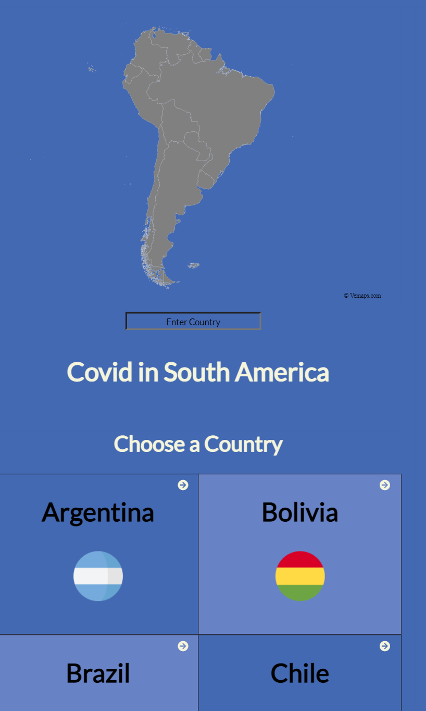
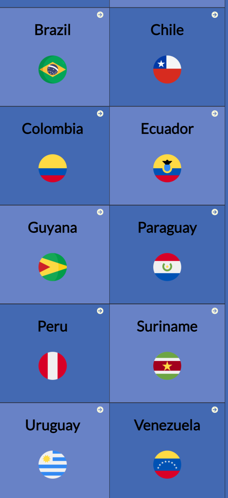
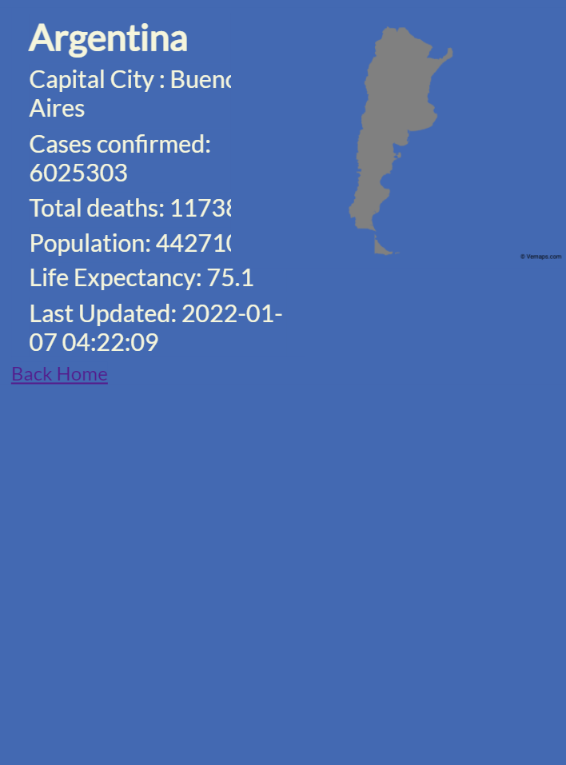

# Covid 19 In South America

> In this project I created a SPA application using react-redux to consume Covid 19 Data API

This project is about building a mobile web application to check a list of metrics using React and Redux.

## Built With

- React and Redux
- Redux-thunk, Redux-logger, axios.
- React Testing Library
- Covid 19 API

## Live Demo

[Live Demo Link](https://react-redux-capstone-sj1978.herokuapp.com)

## Presentation

[Video Link](https://www.loom.com/share/5ff15e8e2f8745d9840299d98d1d49b3)

## Getting Started

To get a local copy up and running follow these simple steps.

### Prerequisites
- A working Laptop or Desktop
- Internet
- Knowledge of React, Redux, TDD, CSS

### Setup
- Install code editor
- Install Git bash
- Install react app
- Install react-redux
### Install

- React:
npx create-react-app the-app-name
- Redux: 
npm install redux react-redux 

### Dependencies
npm install redux-thunk 
npm install redux-devtools-extension 
npm install redux-logger
npm install axios
npm install react-router-dom

### Clone Project
[Covid-19-app](https://github.com/sj1978/react-redux-capstone.git)

### Usage

The Covid-19 application collects information from different data sources to provide comprehensive data of all cases of covid in South Amercia.

### Run tests
- npm run start
- npm run test

### Deployment

- [Heroku](https://www.heroku.com/)

## Authors

👤 **Anibal Amoroso**

- GitHub: [@githubhandle](https://github.com/sj1978)
- LinkedIn: [LinkedIn](https://www.linkedin.com/in/anibalamoroso/)

## 🤝 Contributing

Contributions, issues, and feature requests are welcome!

## Show your support

Give a ⭐️ if you like this project!

## Acknowledgements

Amazing design by: [Nelson Sakwa](https://www.behance.net/sakwadesignstudio)

## 📝 License

This project is [MIT](./MIT.md) licensed.